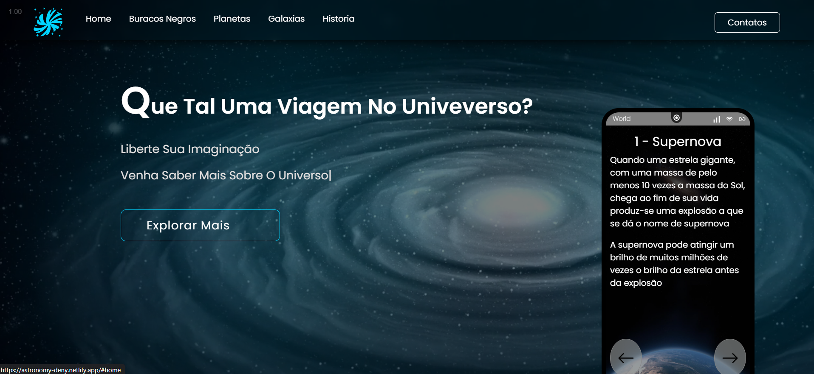
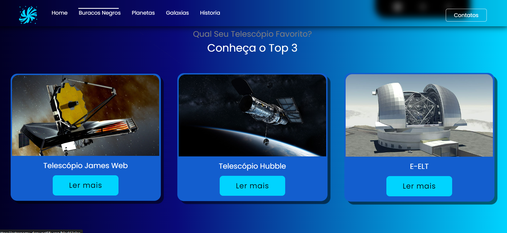
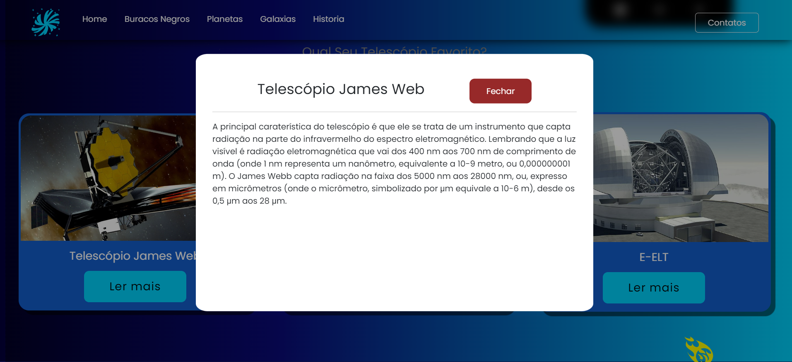

### Scientific outreach project, with a focus on astronomy.

```bash
#clone this repository
git clone https://github.com/Deny-santos/whatsbeyond.git


#inside the folder
#install all dependencies
npm i

#run the front-end
npm run dev
# or
yarn dev
# or
pnpm dev
```
<div align="center">
    "
</div>

<div align="center">
    "
</div>

<div align="center">
    "
</div>

# enjoy !